# Proyecto SQL: Análisis Financiero y Contable - Gestión de Cuentas por Cobrar y Transacciones

## Resumen (Overview)
El personal contable y financiero de **SQLITO SAC** desea mejorar el control de sus cuentas por cobrar, optimizar la gestión de pagos y obtener una visión clara del estado de sus transacciones. Sin embargo, no cuentan con una visión clara de los datos financieros consolidados. Mi objetivo es utilizar **SQL** dentro de **SQL Server Management Studio**, analizando sus transacciones contables (montos, tipos de cuenta, clientes y métodos de pago) para proporcionar recomendaciones al departamento de Finanzas que faciliten decisiones exitosas.
## 📩 Si quieres aprender SQL Conéctate conmigo
<p align="center">

## Estructura del Proyecto

- [Sobre los Datos](#sobre-los-datos)
- [Tareas](#tareas)
- [Limpieza de Datos](#limpieza-de-datos)
- [Análisis Exploratorio de Datos e Insights](#análisis-exploratorio-de-datos-e-insights)

## Sobre los Datos
Los datos originales, junto con una explicación de cada columna, se pueden encontrar [aquí](https://www.kaggle.com/datasets/jazidesigns/financial-accounting)

El conjunto de datos incluye una tabla que captura transacciones contables: montos de débito y crédito, categorías de cuenta, tipos de transacción, clientes/proveedores y métodos de pago, distribuidos en 100,000 registros y 10 columnas.
![Sample table of financial transactions showing column headers and several example rows. Visible column headers include Date, Account, Debit, Credit, Category, Customer_Vendor and Reference. Example rows show dates, account names, numeric debit and credit amounts, categories such as Asset Liability Revenue Expense, customer or vendor names and reference identifiers. The image presents a sterile spreadsheet environment typical of accounting reports and conveys a factual, data-focused tone.]

## Tareas (Task)

En este análisis, ayudo al departamento de **Finanzas y Contabilidad** a responder lo siguiente:
1. **Distribución de cuentas:** ¿Cuánto se ha transaccionado (débito y crédito) en cada categoría de cuenta (Asset, Liability, Revenue, Expense)?
2. **Método de pago:** ¿Cuál es el método de pago más usado, y cuál mueve más dinero?
3. **Top clientes/proveedores:** ¿Quiénes son los 10 clientes/proveedores con mayor monto acumulado?
4. **Transacciones por tipo:** ¿Cuánto se mueve en Ventas, Compras y Transferencias?
5. **Tamaño de transacciones:** ¿Cuántas transacciones son "altas", "medias" o "bajas" según su monto?
6. **Tendencia mensual:** ¿Cómo varía el monto transaccionado mes a mes? ¿Cuál fue el mes más fuerte?
7. **Peso por categoría:** ¿Qué porcentaje del total representa cada categoría de cuenta?
8. **Top 3 por categoría:** Dentro de cada categoría, ¿quiénes son los 3 clientes/proveedores más grandes?
9. **Concentración de riesgo:** ¿El 10% de los clientes/proveedores más grandes concentra la mayoría del dinero transaccionado?
10. **Crecimiento mes a mes:** ¿Cuánto creció o cayó el monto transaccionado respecto al mes anterior?
11. **Clientes atípicos:** ¿Hay clientes/proveedores cuyo comportamiento se aleja mucho del promedio de su categoría?
12. **Ingresos vs. Gastos:** Mes a mes, ¿el ingreso (Revenue) superó al gasto (Expense), o fue al revés?

## Limpieza de Datos
Antes de realizar el análisis, es fundamental asegurar que los datos estén limpios y listos. El trabajo se centra en la tabla `financial_accounting`, que contiene 100,000 registros de transacciones contables.

#### Valores Nulos o Faltantes
Primero, verifiqué la existencia de valores faltantes en los campos clave: `Date`, `Account`, `Debit`, `Credit`, `Category`, `Customer_Vendor` y `Reference`. No se encontraron valores nulos.

```sql
---Verificar valores faltantes en columnas clave
SELECT 
    SUM(CASE WHEN [Date] IS NULL THEN 1 ELSE 0 END) AS Nulos_Date,
    SUM(CASE WHEN [Account] IS NULL THEN 1 ELSE 0 END) AS Nulos_Account,
    SUM(CASE WHEN [Debit] IS NULL THEN 1 ELSE 0 END) AS Nulos_Debit,
    SUM(CASE WHEN [Credit] IS NULL THEN 1 ELSE 0 END) AS Nulos_Credit,
    SUM(CASE WHEN [Category] IS NULL THEN 1 ELSE 0 END) AS Nulos_Category,
    SUM(CASE WHEN [Customer_Vendor] IS NULL THEN 1 ELSE 0 END) AS Nulos_Cliente,
    SUM(CASE WHEN [Reference] IS NULL THEN 1 ELSE 0 END) AS Nulos_Reference
FROM dbo.financial_accounting;
```
#### Valores Duplicados 
Se verificó la existencia de duplicados en el campo `Reference`. Se encontraron **27,470 registros** con números de referencia repetidos
```sql
-- Verificar valores duplicados en la tabla financial_accounting 

SELECT [Reference], COUNT(*) AS Cantidad
FROM dbo.financial_accounting
GROUP BY [Reference]
HAVING COUNT(*) > 1;
```
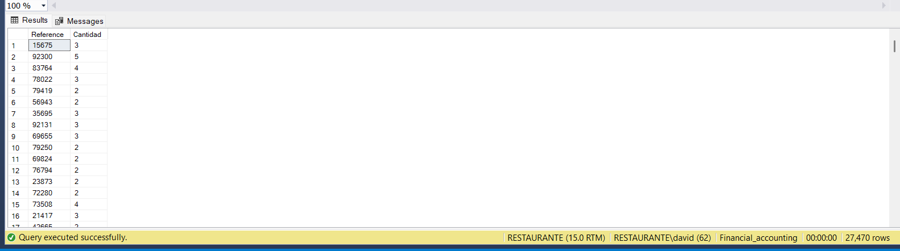

## Análisis Exploratorio de Datos (EDA) e Insights
### Pregunta 1 : ¿Cuánto se ha transaccionado (débito y crédito) en cada categoría de cuenta?

Encontré el monto total transaccionado y el número de transacciones por cada categoría de cuenta, utilizando las funciones SUM, COUNT y GROUP BY.

```sql
-- Distribución de montos por categoría de cuenta 

SELECT 
    Category,
    COUNT(*) AS Total_Transacciones,
    SUM(Debit) AS Total_Debito,
    SUM(Credit) AS Total_Credito
FROM dbo.financial_accounting
GROUP BY Category
ORDER BY Total_Debito DESC;
```
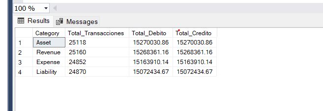

*Monto total de débito y crédito por categoría de cuenta*

Las cuatro categorías de cuenta (Asset, Revenue, Expense, Liability) muestran un volumen de transacciones y montos muy equilibrados entre sí (25,000 transacciones y 15 millones cada una), sin una categoría que domine claramente sobre las demás. Además, se confirma que el monto de débito es idéntico al de crédito en cada categoría.

Dado este equilibrio entre categorías, el equipo financiero podría enfocar sus esfuerzos de control y auditoría de manera uniforme entre las cuatro áreas, sin necesidad de priorizar una categoría sobre otra por volumen de operaciones.

### Pregunta 2 : ¿Cuál es el método de pago más usado, y cuál mueve más dinero?

Identifiqué el método de pago más utilizado y el que mayor monto total ha movido, usando COUNT, SUM y GROUP BY.
```sql
-- Método de pago más usado y monto total movido --

SELECT 
    Payment_Method,
    COUNT(*) AS Total_Transacciones,
    SUM(Debit) AS Monto_Total
FROM dbo.financial_accounting
GROUP BY Payment_Method
ORDER BY Monto_Total DESC;
```
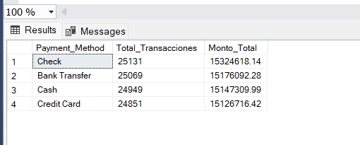

*Transacciones y monto total por método de pago*

Los cuatro métodos de pago (Check, Bank Transfer, Cash, Credit Card) presentan una distribución muy equilibrada, tanto en cantidad de transacciones (25,000 cada uno) como en monto total (15 millones cada uno). El método Check lidera ligeramente con $15.3 millones, pero la diferencia frente al de menor volumen (Credit Card) es inferior al 1.3%, por lo que no se identifica una preferencia dominante de pago.

Dado este equilibrio, no sería recomendable que la empresa invierta desproporcionadamente en optimizar un solo canal de pago ; en su lugar, convendría mantener soporte robusto para los cuatro métodos por igual, ya que todos representan un peso similar en el flujo de caja.

### Pregunta 3 : ¿Quiénes son los 10 clientes/proveedores con mayor monto acumulado?

Identifiqué los 10 clientes/proveedores con mayor monto total transaccionado, usando SUM, COUNT, GROUP BY, ORDER BY y TOP.

```sql
-- Top 10 clientes/proveedores por monto acumulado 

SELECT TOP 10
    Customer_Vendor,
    COUNT(*) AS Total_Transacciones,
    SUM(Debit) AS Monto_Total
FROM dbo.financial_accounting
GROUP BY Customer_Vendor
ORDER BY Monto_Total DESC;
```
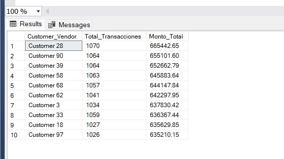

*Los 10 clientes/proveedores con mayor monto acumulado*

Customer 28 lidera el ranking con $665,442.65 en 1,070 transacciones, seguido de cerca por Customer 90 y Customer 39. La diferencia entre el cliente #1 y el #10 del ranking es de apenas 4.6%, lo que indica que no existe una dependencia crítica de un solo cliente/proveedor dentro del Top 10; el riesgo de concentración está distribuido de forma relativamente uniforme entre ellos.

Dado que ningún cliente individual representa un riesgo desproporcionado dentro de este grupo, el equipo financiero podría enfocar sus estrategias de fidelización o negociación de forma similar entre estos 10 clientes/proveedores, sin necesidad de tratar a uno de ellos como cuenta crítica aislada.

### Pregunta 4 : ¿Cuánto se mueve en cada tipo de transacción?

Identifiqué el monto total y número de transacciones por tipo, usando SUM, COUNT y GROUP BY. La cual me permitio identificar 4 tipos de transacciones 

```sql
-- Monto total y transacciones por tipo 

SELECT 
    Transaction_Type,
    COUNT(*) AS Total_Transacciones,
    SUM(Debit) AS Monto_Total
FROM dbo.financial_accounting
GROUP BY Transaction_Type
ORDER BY Monto_Total DESC;
```
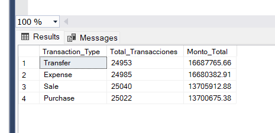

*Monto total y cantidad de transacciones por tipo*

Transfer y Expense concentran los mayores montos ($16.7 millones cada uno), superando a Sale y Purchase ($13.7 millones cada uno), a pesar de que el número de transacciones es similar entre los cuatro tipos (25,000). Esto indica que, en promedio, las transacciones de Transfer y Expense tienen un valor individual más alto que las de Sale y Purchase.

Esta diferencia podría orientar al equipo financiero a poner mayor atención de control y auditoría sobre las transferencias y gastos, dado que representan un mayor movimiento de capital por transacción individual, aumentando el impacto potencial de cualquier error o irregularidad en ese tipo de operación.

### Pregunta 5 : ¿Cuántas transacciones son "altas", "medias" o "bajas" según su monto?

Clasifiqué cada transacción en tres rangos (Alta: ≥$700, Media: $300-$699, Baja: <$300) usando CASE WHEN, y agrupé los resultados con GROUP BY.
```sql
-- Clasificación de transacciones por tamaño de monto --

SELECT 
    CASE 
        WHEN Debit >= 700 THEN 'Alta'
        WHEN Debit >= 300 THEN 'Media'
        ELSE 'Baja'
    END AS Rango_Monto,
    COUNT(*) AS Total_Transacciones,
    SUM(Debit) AS Monto_Total
FROM dbo.financial_accounting
GROUP BY 
    CASE 
        WHEN Debit >= 700 THEN 'Alta'
        WHEN Debit >= 300 THEN 'Media'
        ELSE 'Baja'
    END
ORDER BY Monto_Total DESC;
```
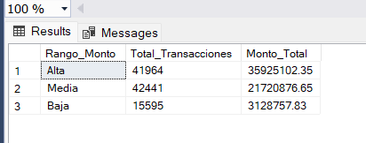  

*Cantidad de transacciones y monto total por rango*

El 84.4% de las transacciones se concentra en los rangos Media y Alta, con las transacciones Altas aportando el mayor monto total ($35.9M), a pesar de tener ligeramente menos transacciones que el rango Medio. Las transacciones Bajas, aunque representan el 15.6% del volumen, solo aportan el 5.2% del monto total transaccionado.

Esta distribución sugiere que el equipo financiero podría priorizar sus controles y revisiones en las transacciones de rango Alto, ya que concentran la mayor parte del capital movido, mientras que las transacciones de bajo monto podrían auditarse con menor frecuencia o mediante muestreo, optimizando así los recursos de control interno.

### Pregunta 6 : ¿Cómo varía el monto transaccionado mes a mes? ¿Cuál fue el mes más fuerte?

Agrupé las transacciones por año-mes usando FORMAT y GROUP BY, para observar la tendencia a lo largo de 2023.

```sql
-- Tendencia mensual de monto transaccionado 

SELECT 
    FORMAT([Date], 'yyyy-MM') AS Mes,
    COUNT(*) AS Total_Transacciones,
    SUM(Debit) AS Monto_Total
FROM dbo.financial_accounting
GROUP BY FORMAT([Date], 'yyyy-MM')
ORDER BY Mes ASC;
```
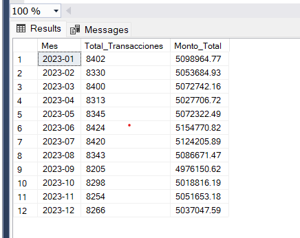  

*Monto total transaccionado por mes durante 2023*

Junio fue el mes con mayor monto transaccionado ($5.15M), mientras que Septiembre registró el más bajo ($4.98M). La diferencia entre el mes más fuerte y el más débil es de apenas 3.5%, mostrando un comportamiento muy estable a lo largo del año, sin estacionalidad marcada ni picos atípicos.

Dado que no se observan patrones estacionales fuertes, el equipo financiero no necesitaría ajustar significativamente sus proyecciones de flujo de caja por mes; el negocio  se comporta de manera consistente durante todo el año.

### Pregunta 7 : ¿Qué porcentaje del total representa cada categoría de cuenta?

Calculé la participación porcentual de cada categoría sobre el monto total general, usando una Window Function (SUM() OVER()) para obtener el total sin necesidad de una subconsulta.

```sql
-- Participación porcentual de cada categoría sobre el total --

SELECT 
    Category,
    SUM(Debit) AS Monto_Categoria,
    SUM(SUM(Debit)) OVER () AS Monto_Total_General,
    ROUND(
        SUM(Debit) * 100.0 / SUM(SUM(Debit)) OVER (), 2
    ) AS Porcentaje
FROM dbo.financial_accounting
GROUP BY Category
ORDER BY Porcentaje DESC;
```
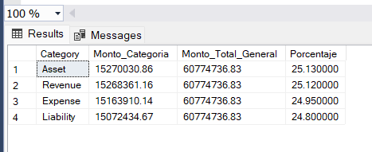 

*Participación porcentual de cada categoría sobre el monto total*

Cada categoría representa aproximadamente el 25% del monto total transaccionado (rango de 24.80% a 25.13%). Ninguna categoría concentra una porción significativamente mayor que las demás.

Dado este equilibrio, el equipo financiero puede distribuir sus recursos de control y auditoría de manera uniforme entre las cuatro categorías, sin necesidad de priorizar una sobre otra.

### Pregunta 8 : Dentro de cada categoría, ¿quiénes son los 3 clientes/proveedores más grandes?

Identifiqué el top 3 de clientes/proveedores por monto dentro de cada categoría de cuenta, usando un CTE junto con la Window Function RANK() y PARTITION BY.

```sql
-- Top 3 clientes/proveedores por categoría de cuenta 

WITH RankedClientes AS (
    SELECT 
        Category,
        Customer_Vendor,
        SUM(Debit) AS Monto_Total,
        RANK() OVER (PARTITION BY Category ORDER BY SUM(Debit) DESC) AS Ranking
    FROM dbo.financial_accounting
    GROUP BY Category, Customer_Vendor
)
SELECT *
FROM RankedClientes
WHERE Ranking <= 3
ORDER BY Category, Ranking;
```
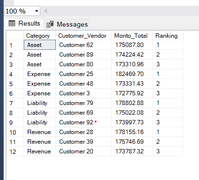  

*Los 3 clientes/proveedores con mayor monto dentro de cada categoría*

Customer 25 lidera la categoría Expense con el monto individual más alto del ranking ($182,469.70). Ningún cliente aparece en el top 3 de más de una categoría, lo que indica que el liderazgo por volumen está distribuido entre distintos clientes según el tipo de cuenta que manejan.

El equipo financiero puede usar este ranking para establecer relaciones comerciales prioritarias con estos 12 clientes/proveedores clave, ya que representan los mayores volúmenes de movimiento dentro de cada categoría de cuenta.

### Pregunta 9 : ¿El 10% de los clientes/proveedores más grandes concentra la mayoría del dinero transaccionado?

Analicé la concentración de riesgo dividiendo a los clientes/proveedores en deciles según su monto total, usando un CTE combinado con la Window Function NTILE().

```sql
-- Concentración de riesgo: % del monto en manos del 10% de clientes más grandes --

WITH MontoPorCliente AS (
    SELECT 
        Customer_Vendor,
        SUM(Debit) AS Monto_Total
    FROM dbo.financial_accounting
    GROUP BY Customer_Vendor
),
Deciles AS (
    SELECT 
        Customer_Vendor,
        Monto_Total,
        NTILE(10) OVER (ORDER BY Monto_Total DESC) AS Decil
    FROM MontoPorCliente
)
SELECT 
    CASE WHEN Decil = 1 THEN 'Top 10%' ELSE 'Resto (90%)' END AS Grupo,
    COUNT(*) AS Cantidad_Clientes,
    SUM(Monto_Total) AS Monto_Grupo,
    ROUND(SUM(Monto_Total) * 100.0 / SUM(SUM(Monto_Total)) OVER (), 2) AS Porcentaje_Del_Total
FROM Deciles
GROUP BY CASE WHEN Decil = 1 THEN 'Top 10%' ELSE 'Resto (90%)' END;
```
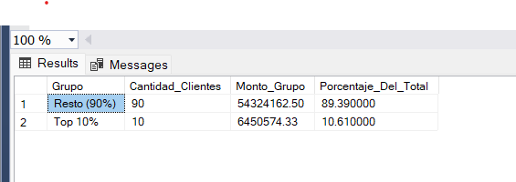

*Distribución del monto total entre el Top 10% y el resto de clientes/proveedores*

El 10% de los clientes/proveedores con mayor volumen concentra únicamente el 10.61% del monto total transaccionado, una proporción prácticamente idéntica a su peso numérico. Esto indica que la cartera de clientes/proveedores está distribuida de forma muy equitativa, sin que existan cuentas dominantes que concentren el riesgo financiero.

Esta baja concentración es una señal positiva para la empresa: no depende críticamente de un grupo reducido de clientes/proveedores, lo que reduce el riesgo ante la eventual pérdida de alguna de estas relaciones comerciales.

### Pregunta 10 : ¿Hay clientes/proveedores cuyo comportamiento se aleja mucho del promedio de su categoría?

Comparé el monto promedio por transacción de cada cliente/proveedor contra el promedio general de su categoría, usando un CTE junto con AVG() OVER (PARTITION BY ...), y filtré los 15 casos con mayor desviación.
```sql
-- Top 15 clientes/proveedores más atípicos respecto al promedio de su categoría --

WITH PromedioPorTransaccion AS (
    SELECT 
        Category,
        Customer_Vendor,
        AVG(Debit) AS Promedio_Cliente,
        AVG(AVG(Debit)) OVER (PARTITION BY Category) AS Promedio_Categoria
    FROM dbo.financial_accounting
    GROUP BY Category, Customer_Vendor
)
SELECT TOP 15
    Category,
    Customer_Vendor,
    ROUND(Promedio_Cliente, 2) AS Promedio_Cliente,
    ROUND(Promedio_Categoria, 2) AS Promedio_Categoria,
    ROUND(Promedio_Cliente - Promedio_Categoria, 2) AS Diferencia,
    ROUND((Promedio_Cliente - Promedio_Categoria) * 100.0 / Promedio_Categoria, 2) AS Porcentaje_Desviacion
FROM PromedioPorTransaccion
ORDER BY ABS(Promedio_Cliente - Promedio_Categoria) DESC;
```
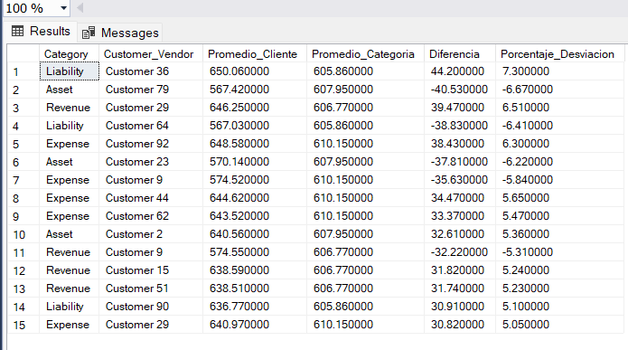

*Top 15 clientes/proveedores con mayor desviación respecto al promedio de su categoría*

Customer 36 (Liability) presenta la mayor desviación positiva, con un promedio de transacción 7.30% superior al de su categoría, mientras que Customer 79 (Asset) muestra la mayor desviación negativa, con -6.67%. En general, las desviaciones del Top 15 se mantienen en un rango moderado (entre 5% y 7.3%), sin casos que representen un comportamiento extremadamente anómalo.

El equipo financiero puede usar este listado como punto de partida para revisar si estos clientes con desviaciones más altas manejan condiciones comerciales particulares (montos mínimos de compra, descuentos por volumen, etc.) que expliquen su comportamiento diferenciado.

### Pregunta 11: Mes a mes, ¿el ingreso (Revenue) superó al gasto (Expense), o fue al revés?

Comparé el monto de Revenue contra el de Expense en cada mes, usando un CTE con CASE WHEN dentro de SUM() para separar ambas categorías, y clasifiqué el resultado neto de cada mes.

```sql
-- Comparativa Revenue vs Expense por mes --

WITH ResumenMensual AS (
    SELECT 
        FORMAT([Date], 'yyyy-MM') AS Mes,
        SUM(CASE WHEN Category = 'Revenue' THEN Debit ELSE 0 END) AS Total_Revenue,
        SUM(CASE WHEN Category = 'Expense' THEN Debit ELSE 0 END) AS Total_Expense
    FROM dbo.financial_accounting
    GROUP BY FORMAT([Date], 'yyyy-MM')
)
SELECT 
    Mes,
    Total_Revenue,
    Total_Expense,
    Total_Revenue - Total_Expense AS Resultado_Neto,
    CASE 
        WHEN Total_Revenue > Total_Expense THEN 'Ganancia'
        WHEN Total_Revenue < Total_Expense THEN 'Pérdida'
        ELSE 'Equilibrio'
    END AS Estado
FROM ResumenMensual
ORDER BY Mes ASC;
```
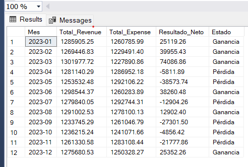

*Comparativa de ingresos y gastos mes a mes durante 2023*

El año 2023 cerró con 6 meses de ganancia y 6 meses de pérdida. Marzo fue el mes más rentable (+$74,086.86), mientras que Mayo registró la mayor pérdida (-$38,573.74). El segundo semestre mostró mayor debilidad, con pérdidas en 4 de 5 meses entre julio y noviembre, aunque diciembre logró cerrar el año con una recuperación positiva (+$25,352.26).

Esta alternancia entre ganancias y pérdidas sugiere que la empresa no tiene un control estable de sus gastos operativos frente a sus ingresos. El equipo financiero debería investigar las causas del deterioro observado en el segundo semestre, especialmente en mayo, julio, septiembre y noviembre, para identificar si corresponde a gastos extraordinarios, estacionalidad de ingresos, o falta de control presupuestario.

## Conclusiones Generales

Tras el análisis de las 100,000 transacciones contables registradas durante 2023, se identificaron los siguientes hallazgos clave:

**Distribución del negocio:**
- Las cuatro categorías de cuenta (Asset, Revenue, Expense, Liability) mantienen un peso equilibrado, cada una representando aproximadamente el 25% del monto total transaccionado.
- Los cuatro métodos de pago (Check, Bank Transfer, Cash, Credit Card) también muestran una distribución pareja, sin un canal dominante.

**Cartera de clientes/proveedores:**
- El Top 10 de clientes/proveedores está compuesto por cuentas de valor similar, sin dependencia crítica de uno solo.
- El 10% de los clientes/proveedores más grandes concentra únicamente el 10.61% del monto total, lo que indica una cartera diversificada y de bajo riesgo de concentración.
- Se identificaron 15 clientes/proveedores con desviaciones moderadas (5%-7.3%) respecto al promedio de su categoría, que podrían revisarse por condiciones comerciales particulares.

**Comportamiento financiero:**
- El año 2023 se mantuvo estable mes a mes en volumen de transacciones, sin estacionalidad marcada (variación máxima de 3.5% entre el mes más fuerte y el más débil).
- Al comparar Revenue vs. Expense, el año cerró dividido entre 6 meses de ganancia y 6 de pérdida, con un deterioro notable en el segundo semestre (4 de 5 meses en pérdida entre julio y noviembre).

**Recomendación principal:**
El equipo financiero debería priorizar la investigación de las causas detrás de las pérdidas recurrentes del segundo semestre, particularmente en mayo, julio, septiembre y noviembre, ya que representan el mayor riesgo identificado en este análisis frente a una cartera de clientes y estructura de cuentas que, por lo demás, se mantiene sana y diversificada.